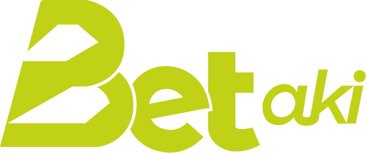

<p align="center">

<h3 align="center">
Plataforma web da BetAki
</h3>
</p>

<span align="center">
<br />

[](https://nextjs.org/)

</span>

## 🔗 Instalação

Para instalar as dependências do projeto, execute o seguinte comando:

```bash
npm install
```

## ⚙️ Uso

Para iniciar a aplicação em modo de desenvolvimento, utilize o comando:

```bash
npm run dev
```

A aplicação estará disponível em `http://localhost:3000`.

## 🔑 Licença

Desenvolvido por Diogo Oliveira Lins [GOATech - Serviços Digitais](https://goatech.com.br).
